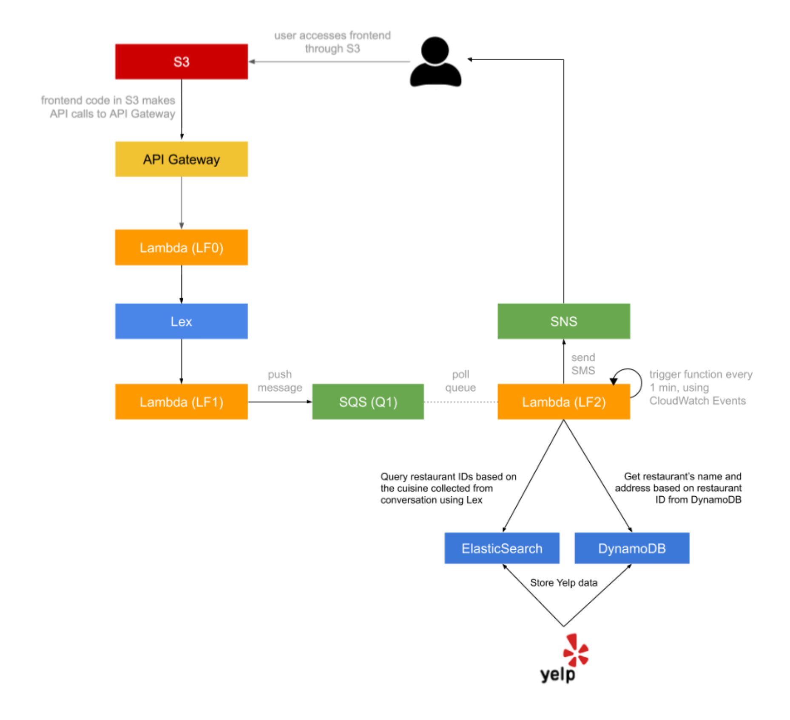

# Dining Concierge Chatbot
Implemented a serverless, microservice-driven web application. Specifically, you will build a Dining Concierge chatbot that sends you restaurant suggestions given a set of preferences that you provide the chatbot with through conversation

### Services/ Technologies:

- AWS S3
- AWS API Gateway
- Swagger
- AWS Lambda
- AWS Lex
- AWS SQS
- AWS SES
- DynamoDB
- AWS Opensearch/ElasticSearch
- AWS Cloudwatch

### Architecture:

  

